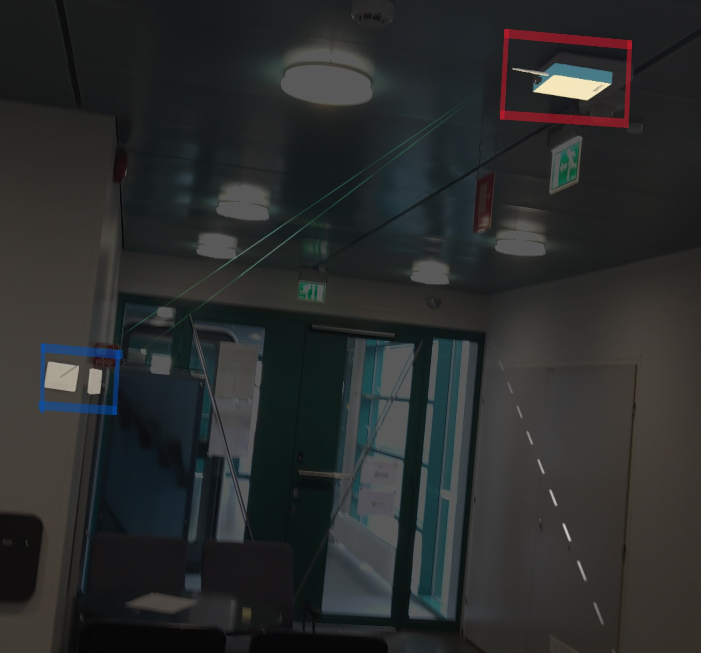

# SCAR
Repo for my smart campus AR application made in unity and deployed on HoloLens2

# Smart Campus Augmented Reality (SCAR) application deployed on HoloLens2 using MRTK, SceneUnderstanding and Azure Anchors.

## A demo application to export an IoT/SmartCampus structure to an augmented environemnt on HoloLens2 and interact with the network at hand.

This project is an example to how an IoT application could be upgraded to augmented reality and easily interacted with. The project is made in Unity 2021.3.16f using MRTK 2, SceneUnderstanding SDK and Azure Anchors. It has the potential to offer these functionalities:

- Set-up and visualise a network of sensors and gateways in AR
- Retreive the augmented visualization anytime near the real world location of the network (currently it is set to 1 day, tested up to 90 days)
- Retreive information being passed via the network and visualise it (work in progress)

## How to Set-Up this application

1. First download unity 2021.3.16f - https://unity.com/releases/editor/whats-new/2021.3.16
2. Clone this repo and open project in unity
3. Set-up MRTK2 in Unity for HoloLens2 - https://learn.microsoft.com/en-us/windows/mixed-reality/mrtk-unity/mrtk2/?view=mrtkunity-2022-05 (if you dont have access to a HoloLens2 explore using an emulator - https://learn.microsoft.com/en-us/windows/mixed-reality/develop/advanced-concepts/using-the-hololens-emulator)
4. Set-Up azure anchors in unity - https://learn.microsoft.com/en-us/training/modules/azure-spatial-anchors-tutorials/
5. Download Scene Understanding SDK packages - https://learn.microsoft.com/en-us/windows/mixed-reality/develop/unity/scene-understanding-sdk
6. Once everything is set up and no errors are shown in unity deploy the app to HoloLens2 by first setting up build settings - https://learn.microsoft.com/en-us/windows/mixed-reality/develop/unity/build-and-deploy-to-hololens then using MRTK build window accessible in unity (Mixed Reality -> ToolKit -> Utilities -> Build Window) Then select the scenes you want to build then buidl all and install.
7. Head to your HoloLens2 Device portal(https://learn.microsoft.com/en-us/windows/mixed-reality/develop/advanced-concepts/using-the-windows-device-portal) to deploy the app using Views->Apps then choosing file from .\SUTest\Builds\WSAPlayer\AppPackages\SUTest\SUTest_1.0.117.0_ARM64_Master_Test (example) and deploy the app
8. Once the app deployed, access it from HoloLens2 (SUTest) and activate quads by pressing the get quads button then you can include sensors/gateways to your network one by one (add sensor or add GW -> save prefabs (ensure an azure session starts by reading from debug window))
9. Once your augmented reality SmartCampus is set up you can visualise the network by pressing the connect button
10. On next run of the app disable all quads and press Find Nodes button to locate the previously set sensors and gateways in your smartcampus directly.

## The application should look like something like this

Find a demo [here](https://www.youtube.com/watch?v=ctoA-h4Iyrk).
## How to tweak this project for your own uses

Since this is an example project, I'd encourage you to clone and rename this project to use for your own puposes.
You will find script files in .\SUTest\Assets\Project Files\Scripts.

## Find a bug?

If you found an issue or would like to submit an improvement to this project, please submit an issue using the issues tab above. If you would like to submit a PR with a fix, reference the issue you created!
You will find script files in .\SUTest\Assets\Project Files\Scripts

## Known issues (Work in progress)

This example is a rough template currentissues are:

1. The application starts with meshes and spatial mesh on which is not whats desired. it is desired for the app to start with quad planes on only.
2. The anchor Ids are saved in a local file on the hololens. Ideally they would be accessible from a database
3. Currently the appis a pure visualization of the smart campus due to the fact that the samrt campus accessible at hand does not offer real time data. if your smart campus offers real time data via MQTT or REST API i recommend exploring using both with HoloLens2 (I previously used both for different apps use these references as guidelines. MQTT : https://github.com/vovacooper/Unity3d_MQTT. REST API:https://forums.hololens.com/discussion/6704/how-to-call-an-api-in-the-hololens )
4. Currently the app visualises the network purely based on proximity. Ideally we want to retreive information via MQTT/HTTPS requests then break the message down to know the sender and receiver of information. and have a previously filled Dictionary(file) with sensors/gateways MAC addresses. Based on this dictionary of MAC addresses and the information collected we can link the sensors and gateways more accurately. What I had in mind was to manually input the MAC addresses of the nodes via the MRTK Keyboard before saving the node (prefab) to the azure anchors cloud and have MAC address saved to a MAC addresses file that would be used to visualise and later on filter out data.
